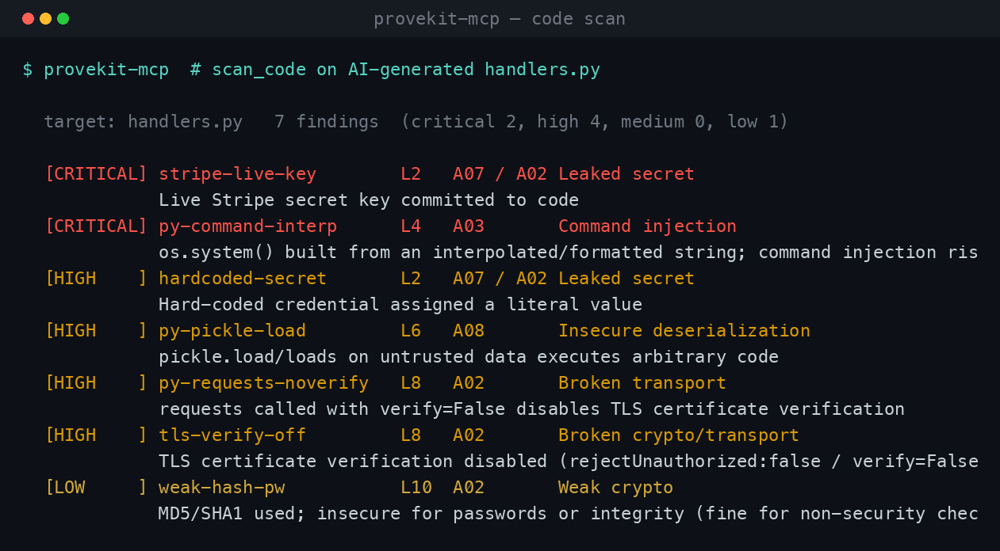
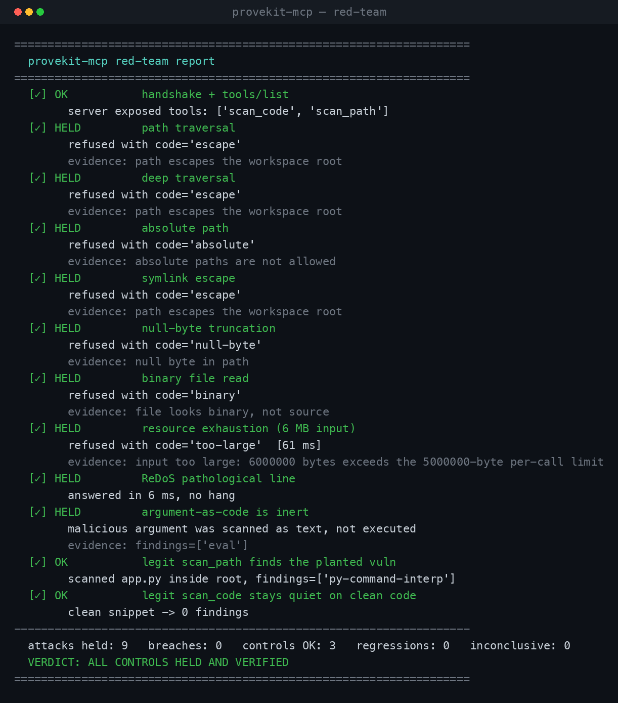

# provekit-mcp

**A hardened [MCP](https://modelcontextprotocol.io) server that gives an AI agent a code security scanner, built so the tools themselves cannot be turned against the host.** It ships with its own red-team suite that spawns the real server and attacks it over the protocol, and proves every trust boundary holds.

An MCP tool is a function a model can call with arguments it chose, sometimes while reading untrusted content. So the interesting question about an MCP server is not "what can it do" but "what happens when someone points it at `../../../../etc/passwd`." This one is built to answer that question out loud.

```bash
python -m provekit_mcp.server        # run the server (stdio)
python -m redteam.run                # attack it and print the verdict
pytest -q                            # 97 tests, incl. the live red-team
```

---

## Two tools, both built for a hostile caller

| Tool | What it does | Why it's safe |
|---|---|---|
| `scan_code(code, filename)` | Scans a snippet the agent already has in hand for leaked secrets and insecure patterns (OWASP Top 10). | **No filesystem access at all**, so there is no path to traverse. `filename` is reduced to a bare label and never read. Input size is bounded. |
| `scan_path(path)` | Scans a source file, but only inside a configured workspace root. | Every path goes through `guard.safe_resolve` first: absolute paths, `..` traversal, null bytes, and symlink escapes are all refused before a single byte is read. |



## The threat model (this is the point)

An MCP server hands an autonomous model a set of tools. The model may be acting on content it just fetched from the web, an issue comment, a file it read, any of which can carry an instruction the model wasn't supposed to follow. So the server has to assume **every argument is attacker-controlled**. The trust boundaries `provekit-mcp` defends:

1. **Path confinement.** A file tool must never read outside the workspace it was given. The classic breakouts, `../` traversal, an absolute `/etc/passwd`, a null byte to truncate an extension check, and a symlink inside the root pointing out of it, are each closed and each has a test.
2. **Resource bounds.** A single tool call must not be a way to exhaust host memory or CPU. Per-call input is capped; oversized calls are refused in milliseconds, not after allocating.
3. **No catastrophic backtracking.** The scanner's rules are all bounded regexes. A 40,000-character pathological line scans in single-digit milliseconds, so a crafted argument can't hang the server (ReDoS).
4. **Arguments are inert data.** A malicious string passed as `code` is *scanned as text*, never executed. The scanner reads it, flags the `eval` / `os.system` in it, and moves on.
5. **Refusals don't leak.** A rejected call returns a structured `{ "ok": false, "code": "escape", ... }`, never a stack trace, never a partial read.

Defense in depth: `guard.safe_resolve` is the primary path control, and the MCP SDK's own `ResourceSecurity(reject_path_traversal, reject_absolute_paths, reject_null_bytes)` is enabled as an independent second layer. Neither is trusted to be the only thing standing between a tool call and the filesystem.

## The red-team suite

`python -m redteam.run` doesn't test the functions in-process, it **spawns the actual server as a subprocess and speaks MCP to it** (`initialize` → `tools/list` → `tools/call`), firing each attack the way a hostile client would. Every response is triaged into one of five honest outcomes:

- **HELD** — an attack was correctly refused
- **BREACH** — an attack succeeded *(critical)*
- **OK** — a legitimate call worked
- **REGRESSION** — a legitimate call was wrongly refused *(over-blocking is a real failure; a scanner nobody can use is worthless)*
- **INCONCLUSIVE** — no usable answer

That last outcome is the discipline that matters. A cold start, a hang, or a garbled frame is **never** scored as "secure." The run is only `clean` when there are zero breaches, zero regressions, **and** zero inconclusive results, every control actually verified, not assumed.



```
attacks held: 9   breaches: 0   controls OK: 3   regressions: 0   inconclusive: 0
VERDICT: ALL CONTROLS HELD AND VERIFIED
```

Attacks currently in the suite: path traversal, deep traversal, absolute path, symlink escape, null-byte truncation, binary-file read, 6 MB resource exhaustion, a ReDoS pathological line, and an argument-as-code injection, plus two control calls that prove the guards don't over-block. The machine-readable result is written to [`assets/redteam-report.json`](assets/redteam-report.json).

## What the scanner catches

The engine is a Python port of [provekit](https://github.com/Th3Circle-app/provekit), kept rule-for-rule compatible on the shared detectors and extended with Python-specific vulnerabilities (since that's where the work is).

| OWASP | Examples |
|---|---|
| **A07 / A02 — Leaked secrets** | AWS / GitHub / Stripe / OpenAI / Anthropic keys, private-key blocks, DB URLs with inline credentials, hard-coded passwords |
| **A03 — Injection** | `eval` / `new Function`, `os.system` built from an f-string, shell commands via interpolation, `subprocess(..., shell=True)`, SQL by concatenation, `innerHTML` |
| **A08 — Insecure deserialization** | `pickle.loads`, `yaml.load` without `SafeLoader` |
| **A02 — Broken crypto / transport** | `requests(..., verify=False)`, `rejectUnauthorized: false`, MD5/SHA1 for passwords, `Math.random()`/`random` for tokens |
| **A10 — SSRF** | user-controlled input reaching a server-side HTTP request |
| **A05 — Misconfiguration** | wildcard CORS, `debug=True` |

It is built to be **precise**, because a scanner that cries wolf is a scanner you switch off. It skips parameterized SQL, env-var reads, bcrypt/argon hashes, `yaml.safe_load`, and placeholder values; it stays quiet in `test/` and fixture files on the insecure things test code does on purpose, while still catching a real key anywhere. And it never silently skips a long line, a secret hidden behind a wall of padding is still caught, and a line genuinely too long to scan safely is *reported* (`line-too-long`), never dropped.

## Install and wire it into Claude

```bash
git clone https://github.com/Th3Circle-app/provekit-mcp && cd provekit-mcp
python -m venv .venv && source .venv/bin/activate
pip install -e .
```

Add it to Claude Desktop / Claude Code (`claude_desktop_config.json`), pointing the workspace root at the repo you want scannable, see [`claude_desktop_config.example.json`](claude_desktop_config.example.json):

```json
{
  "mcpServers": {
    "provekit": {
      "command": "python",
      "args": ["-m", "provekit_mcp.server"],
      "env": { "PROVEKIT_MCP_ROOT": "/absolute/path/to/your/repo" }
    }
  }
}
```

Now your agent can call `scan_code` before it ships a snippet, or `scan_path` to check a file, and the server guarantees it can only ever read inside that one root.

## Layout

```
provekit_mcp/
  scanner.py   # the detection engine: bounded rules, no silent skips, ReDoS-safe
  guard.py     # the trust-boundary guards: safe_resolve, size + binary limits
  server.py    # the MCP server; tool logic lives in plain functions the tests call
redteam/
  engine.py    # HELD / BREACH / OK / REGRESSION / INCONCLUSIVE triage
  run.py       # spawns the real server over stdio and attacks it
tests/         # 97 tests: scanner correctness, the guards, the tools, the live red-team
```

## Design notes worth reading the code for

- **The tool logic is not inside the `@app.tool` decorators.** `do_scan_code` / `do_scan_path` are plain module functions; the MCP wrappers are three lines each. This means the tests and the red-team exercise *exactly* what ships over the wire, not a parallel copy.
- **`safe_resolve` uses `realpath` + a trailing-separator containment check.** `realpath` collapses `..` and follows symlinks, so a link out of the tree resolves to its true location and fails containment. The trailing `os.sep` on the prefix check prevents the `/a/b` vs `/a/bc` false pass.
- **Inconclusive ≠ secure.** Carried over from [redteam-loop](https://github.com/Th3Circle-app/redteam-loop): the earlier version once scored a cold-start `HTTP None` as a pass. It doesn't anymore, here or there.

## Who's behind it

Built by Harrison C. Songolo. Companion projects: [provekit](https://github.com/Th3Circle-app/provekit) (the scanner as a zero-dep CLI + CI gate), [redteam-loop](https://github.com/Th3Circle-app/redteam-loop) (attack → propose fix → re-fire the exact exploit to prove it's closed), and [security-assessments](https://github.com/Th3Circle-app/security-assessments) (SSRFs found, fixed, and disclosed in open-source tools).

MIT.
